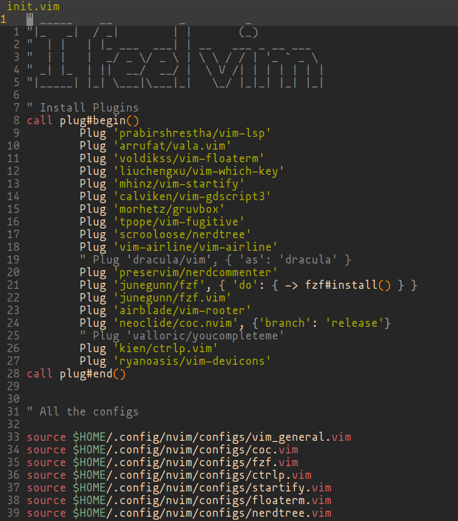

# Introduction
My neovim configuration for linux. This configuration is heavily inspired by some VsCode features.
I have tried to make the configuration as simple as it could by keeping the `init.vim` very simple 
All the configs for the plugins used are in the directory `config`. I use [vim-plug](https://github.com/junegunn/vim-plug).
to manage and install my plugins.

# Features #

+ VsCode like start menu via [startify](https://github.com/mhinz/vim-startify).
+ Floating terminal inside neovim via [floaterm](https://github.com/voldikss/vim-floaterm).
+ Fast file and buffer jumping via [fzf](https://github.com/junegunn/fzf.vim). 
+ Auto-completion using coc [CoC](https://github.com/neoclide/coc.nvim).
+ Git integration via [vim-fugitive](https://github.com/tpope/vim-fugitive).
+ Beautiful status line via [vim-airline](https://github.com/vim-airline/vim-airline).
+ Powerful sidebar via [Nerdtree](https://github.com/scrooloose/nerdtree).
+ ......

# Shortcuts

In the following shortcuts, `<leader>` represents the `<space>` character.

| Shortcut          | Mode   | Description                                               |
|-------------------|--------|-----------------------------------------------------------|
| `<leader>f`       | Normal | Fuzzy file search in a floating window                    |
| `<leader>b`       | Normal | Searches open buffers                                     |
| `<Ctrl>n`         | Normal | Toggles Nerdtree                                          |
| `<leader>tt`      | Normal | Toggles Floaterm window                                   |
| `gd`              | Normal | Go to definition (coc)                                    |
| `gr`              | Normal | Find all the refernces of variable (coc)                  |

You can find more details about the keybindings in the config files or in the plugin website

# Trouble shooting

If you come across an issue, you can first use `:checkhealth` command provided
by `nvim` to trouble-shoot ourself. Please read carefully the messages
provided by health check.

If you still have an issue, you may [open a new issue](https://github.com/gxhamster/neovim/issues).

